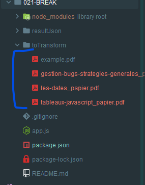
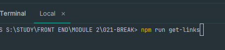
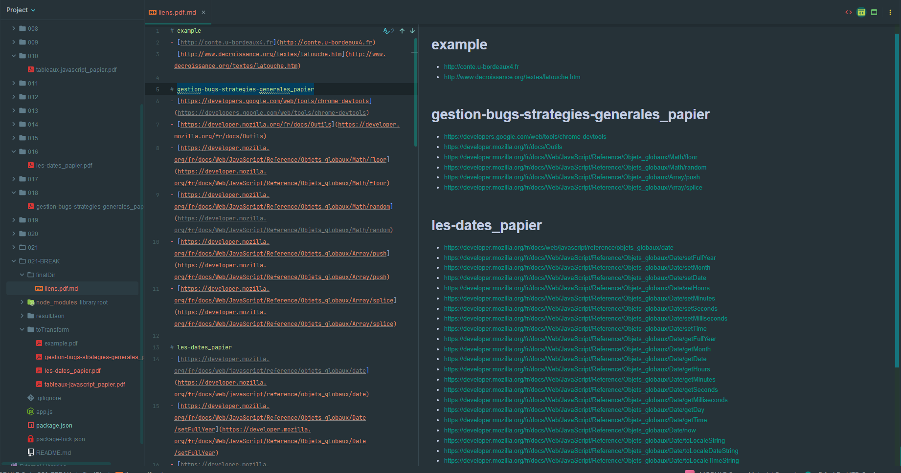
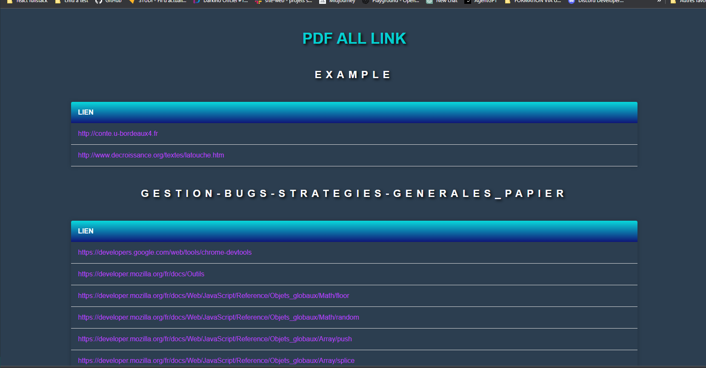
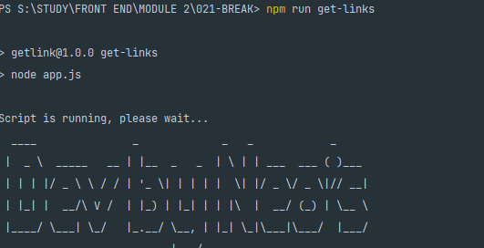

# STUDY GET LINK FROM PDF
Ce script permet de récupérer tous les liens présents dans des fichiers PDF et de les classer par PDF dans un fichier Markdown.

## Pourquoi?:
- J'ai créé ce script pour simplifier ma vie. Je voulais pouvoir récupérer les liens des différentes documentations
  de Study et les regrouper proprement au même endroit, plutôt que de devoir les copier-coller ou les chercher.

- À la base, il ne devait même pas y avoir de sortie en HTML, je l'ai ajouté en plus mais j'ai fait un CSS très basique.

- Je me suis dit que ce serait bien de partager ce script avec les autres étudiants de Study. J'espère que cela pourra en aider certains.

## Utilisation

1. Placez tous les fichiers PDF à analyser dans le dossier `toTransform` à la racine du projet.
2. Initialisez le projet en installant les dépendances avec la commande `npm install`.
3. Lancez la commande `npm run get-links` pour lancer l'analyse des fichiers PDF.
4. Les fichiers JSON contenant les liens seront enregistrés dans le dossier `resultJson` à la racine du projet.
5. Les liens classés par PDF seront enregistrés dans le fichier `liens.pdf.md` & `liens.pdf.html`  dans le dossier 
   `finalDir` à la 
   racine du projet.
6. Ouvrez le fichier `liens.pdf.md` dans certains editeur de code donne un bon rendu visuel (webstorm de jetbrains 
   par  exemple.)
7. Sinon vous pouvez tout simplement ouvrir `liens.pdf.html` dans un navigateur et vous aurez aussi la liste des liens. 

## Personnalisation

- Pour exclure certains liens de l'analyse, modifiez le tableau `excludedLink` dans le fichier `getLinks.js`.
- Pour modifier le nom du fichier MD final, modifiez le nom du fichier passé en argument à la fonction `getAllLink()` dans le fichier `getLinks.js`.
- Pour modifier le dossier de destination du fichier MD final, modifiez le chemin passé en argument à la fonction `getAllLink()` dans le fichier `getLinks.js`.
- Pour modifier le css du rendu html, vous pouvez le modifiez dans `app.js` -> ``

## Configuration
Le script utilise les modules Node.js suivants :

- fs pour lire et écrire des fichiers
- path pour manipuler les chemins de fichiers
- pdf-parse pour extraire le texte des fichiers PDF
- figlet pour afficher le texte stylisé "Dev by Neo's"

## Illustrations: 
- ### Ajouter les fichier PDF
 

## 
- ### Démarrer le projet (penser a faire `npm install` avant)

## 
- ### Rendu MD

## 
- ### Rendu HTML

## 
- ### Script Running
 
 

# ###~~Dev by Neo's
